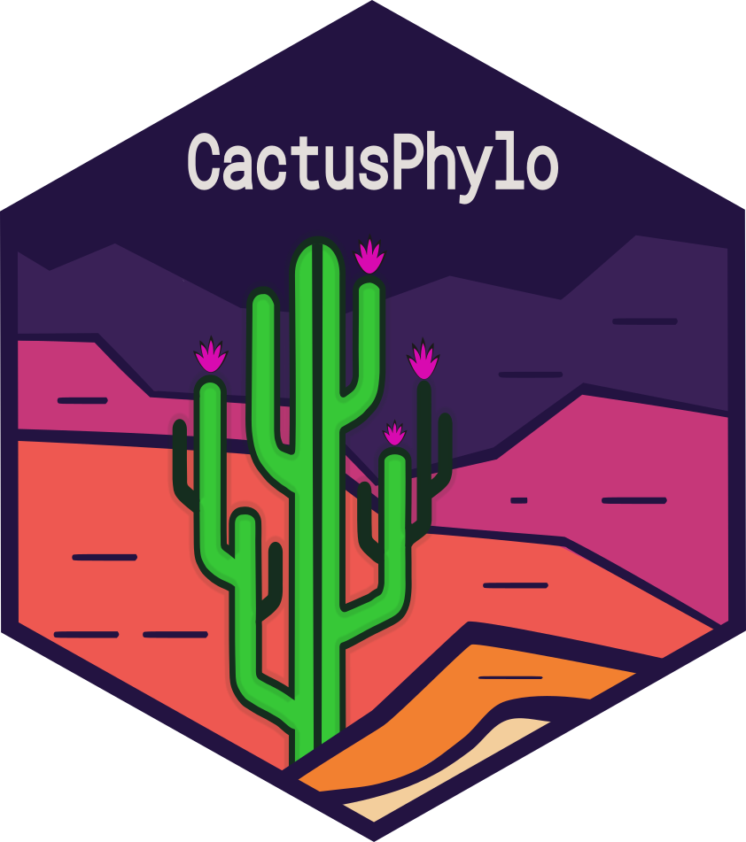
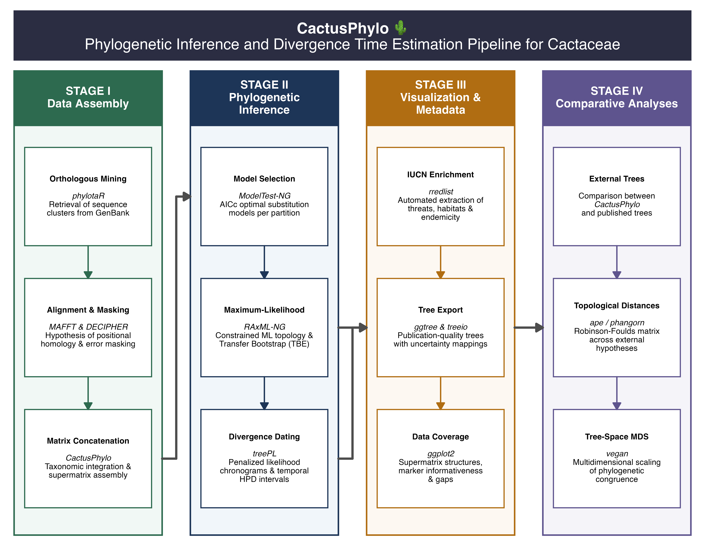

# CactusPhylo 

<!-- badges: start -->

[](https://lifecycle.r-lib.org/articles/stages.html#experimental)[](https://github.com/beeamerino/CactusPhylo/actions/workflows/R-CMD-check.yaml)

<!-- badges: end -->

### Reproducible phylogenetic workflows for data assembly, inference, and divergence time estimation

`CactusPhylo` is an R package for assembling, curating, and analysing multilocus phylogenetic datasets from publicly available DNA sequences.

The package was originally developed for evolutionary studies of **Cactaceae**, but its modular workflow can be applied to any taxonomic group requiring reproducible phylogenetic data preparation, maximum-likelihood inference, divergence time estimation, and downstream comparative analyses.

`CactusPhylo` integrates widely used phylogenetic software into a single reproducible workflow implemented in R.

------------------------------------------------------------------------

# Main Features

The package provides tools for:

- Automating the retrieval of homologous DNA sequence clusters from GenBank using `phylotaR` and `BLAST+`.
- Enforcing positional homology via robust multiple sequence alignments with `MAFFT`.
- Mitigating systematic errors through automated masking of non-homologous segments implemented with `DECIPHER`.
- Standardizing nomenclatural frameworks to assemble curated, unified multilocus datasets.
- Synthesizing concatenated supermatrices and defining structural partition bounds for phylogenetic inference.
- Statistically controlling for mutational heterogeneity by selecting optimal substitution models via `ModelTest-NG`.
- Inferring maximum-likelihood evolutionary hypotheses using `RAxML-NG`.
- Estimating ultrametric chronograms to accommodate evolutionary rate heterogeneity with `treePL`.
- Integrating complex taxonomic and conservation metadata, including statuses from the **IUCN Red List**.
- Producing publication-quality phylogenetic figures and chronological cadastres.
- Quantifying topological congruence and validating alternative phylogenetic hypotheses.

------------------------------------------------------------------------

# Workflow

The complete workflow is organized into four analytical stages comprising thirteen interoperable modules.

{width="100%"}

Each stage can be executed independently or combined into a fully reproducible phylogenetic workflow.

------------------------------------------------------------------------

# Installation

Install the development version directly from GitHub.

``` r
if (!requireNamespace("remotes", quietly = TRUE))
  install.packages("remotes")

remotes::install_github("beeamerino/CactusPhylo")
```

------------------------------------------------------------------------

# R Dependencies

`CactusPhylo` relies on packages available from both CRAN and Bioconductor.

| Repository | Main packages |
|:-----------------------------------|:-----------------------------------|
| **remotes** | `phylotaR` |
| **Bioconductor** | `DECIPHER`, `Biostrings` |
| **CRAN** | ape, ggplot2, dplyr, tidyr, readr, stringr, purrr, rredlist, forcats, scales, RColorBrewer |

# External Software

Several analyses performed by `CactusPhylo` rely on external command-line software that must be installed separately and available from your system `PATH`.

| Software | Purpose | Citation |
|:-----------------------|:-----------------------|:-----------------------|
| [**`BLAST+`**](https://www.ncbi.nlm.nih.gov/books/NBK279690/) | Local sequence alignment and database searching | Camacho, C. *et al*. (2009). BLAST+: Architecture and applications. *BMC Bioinformatics*, *10*. <https://doi.org/10.1186/1471-2105-10-421> |
| [**`MAFFT`**](https://mafft.cbrc.jp/alignment/software/) | Multiple sequence alignment | Katoh, K., & Standley, D. M. (2013). MAFFT multiple sequence alignment software version 7: Improvements in performance and usability. Molecular Biology and Evolution, 30(4), 772–780. <https://doi.org/10.1093/molbev/mst010> |
| [**`ModelTest-NG`**](https://github.com/ddarriba/modeltest) | Model selection | Darriba, D. *et al*. (2020). ModelTest-NG: a new and scalable tool for the selection of DNA and protein evolutionary models. Molecular Biology and Evolution, 37(1), 291-294. doi.org/10.1093/molbev/msz189 |
| [**`RAxML-NG`**](https://github.com/amkozlov/raxml-ng) | Maximum-likelihood phylogenetic inference | Kozlov, A. M. *et al*. (2019). RAxML-NG: A fast, scalable and user-friendly tool for maximum likelihood phylogenetic inference. Bioinformatics, 35(21), 4453–4455. <https://doi.org/10.1093/bioinformatics/btz305> |
| [**`treePL`**](https://github.com/blackrim/treePL) | Divergence time estimation | Smith, S. A., & O’Meara, B. C. (2012). TreePL: Divergence time estimation using penalized likelihood for large phylogenies. Bioinformatics, 28(20), 2689–2690. <https://doi.org/10.1093/bioinformatics/bts492> |

------------------------------------------------------------------------

# Documentation

The recommended way to learn `CactusPhylo` is by following the tutorials in sequence.

| Tutorial | Description |
|:-----------------------------------|:-----------------------------------|
| [**Get Started**](https://beeamerino.github.io/CactusPhylo/articles/CactusPhylo.html) | Package overview and installation |
| [**Tutorial 1**](https://beeamerino.github.io/CactusPhylo/articles/tutorial-1-cactus-phylogeny-prep.html) | Data Assembly and Preparation |
| [**Tutorial 2**](https://beeamerino.github.io/CactusPhylo/articles/tutorial-2-cactus-phylogeny-inference.html) | Phylogenetic Inference and Divergence Time Estimation |
| [**Tutorial 3**](https://beeamerino.github.io/CactusPhylo/articles/tutorial-3-cactus-phylogeny-visualization.html) | Visualization and Metadata Integration |
| [**Tutorial 4**](https://beeamerino.github.io/CactusPhylo/articles/tutorial-4-cactus-phylogeny-validation.html) | Phylogenetic Validation and Comparative Analyses |
| [**Function Reference**](https://beeamerino.github.io/CactusPhylo/articles/tutorial-5-cactus-phylogeny-functions.html) | Complete reference of package functions |

------------------------------------------------------------------------

# Citation

If you use **CactusPhylo** in your research, please cite the package:

``` r
citation("CactusPhylo")
```

If a software paper is available, please cite both the package and the associated publication.

------------------------------------------------------------------------

# License

`CactusPhylo` is released under the **GPL-3 License**.

Bug reports, feature requests, and source code are available through the project's GitHub repository.
