# Tutorial 3: Phylogenetics Pipeline: Data Visualization and IUCN Summaries

## Abstract

This tutorial represents the final stage of the core phylogenetic
reconstruction workflow implemented in **`CactusPhylo`**, focusing on
the integration, visualization, and biological interpretation of the
inferred evolutionary framework. Following the assembly of the
multilocus supermatrix, maximum-likelihood inference, branch support
assessment, and divergence time estimation described in [Tutorial
1](https://beeamerino.github.io/CactusPhylo/articles/tutorial-1-cactus-phylogeny-prep.html)
and [Tutorial
2](https://beeamerino.github.io/CactusPhylo/articles/tutorial-2-cactus-phylogeny-inference.html),
this module transforms the resulting phylogenetic outputs into an
integrative evolutionary resource.

In **Module 11**, phylogenetic results are enriched with external
biological information by integrating species-level metadata and
conservation assessments from the **IUCN Red List**. This step generates
a comprehensive evolutionary registry that links molecular sampling
effort, taxonomic validation, distributional information, and
conservation status. These integrated data provide the foundation for
evaluating biases in genomic representation, identifying threatened
evolutionary lineages, and exploring patterns of conservation
vulnerability across the cactus tree of life.

In **Module 12**, the final phylogenetic products are visualized and
prepared for downstream comparative analyses. The maximum likelihood
topology is displayed together with branch support values, while the
time calibrated chronogram derived from penalized likelihood analyses is
visualized with node age uncertainty intervals obtained from dated
temporal bootstrap replicates. These outputs provide publication ready
representations of both phylogenetic relationships and evolutionary
timescales.

Together, this tutorial completes the construction of a reproducible
phylogenomic framework for **Cactaceae**, integrating evolutionary
history, temporal diversification, and conservation information into a
unified analytical resource suitable for macroevolutionary,
biogeographic, and conservation studies.

## Complete Pipeline Execution Workflow

### Setup: Creating a Clean Workspace

Before proceeding, ensure you have the required packages installed and
set up. We rely on the `rredlist` package to interact securely with the
IUCN Red List API.

To install the required dependencies:

``` r

required_pkgs <- c("dplyr", "tidyr", "stringr", "readr", "ggplot2", "forcats", "purrr", "scales", "rredlist")
new_pkgs <- required_pkgs[!(required_pkgs %in% installed.packages()[,"Package"])]
if(length(new_pkgs)) install.packages(new_pkgs)
```

**IUCN Red List API Access:** To retrieve threat categories
automatically, you must generate a free API token from the IUCN Red List
API:

1.  Go to the [IUCN Red List API Token Generation
    Page](https://apiv3.iucnredlist.org/api/v3/token).

2.  Fill out the form to request your token.

3.  Once approved, the IUCN will send you an API key. Store this key in
    your `.Renviron` file using: `usethis::edit_r_environ()` and adding
    the line `IUCN_REDLIST_KEY="your_api_key"`.

### Data Setup & Pre-processing

To quickly run the analyses in this module, you can copy the entire
executable script to your tutorial directory:

``` r

tutorial_dir <- "~/Desktop/CactusPhylo_Tutorial"
setwd(tutorial_dir)

# Copy the entire tutorial script for easy execution
file.copy(
  system.file("scripts", "tutorial-3-cactus-phylogeny-visualization.R", package = "CactusPhylo"),
  file.path(tutorial_dir, "tutorial-3-cactus-phylogeny-visualization.R")
)
```

### Module 11: Data Visualization and IUCN Enrichment

This vignette assumes that you have completed [Tutorial 2: Inference &
Dating](https://beeamerino.github.io/CactusPhylo/articles/tutorial-2-cactus-phylogeny-inference.html).
Following the completion of maximum likelihood phylogenetic inference,
branch support estimation, and divergence time reconstruction, this
module focuses on enriching the resulting evolutionary framework with
biological metadata and generating comprehensive visual summaries of the
final phylogenomic dataset.

#### The Scientific Importance of an Integrative Evolutionary Registry

At this stage, `CactusPhylo` will generates an integrative phylogenetic
and conservation registry that links evolutionary relationships with
complementary biological information, including taxonomic validation,
geographic distribution, habitat associations, IUCN conservation
assessments, and molecular sampling coverage.

The family **Cactaceae** contains numerous geographically restricted
endemics and highly vulnerable evolutionary lineages affected by habitat
loss, anthropogenic disturbance, and climate-driven environmental
change.

By integrating conservation assessments directly with phylogenetic
relationships, this framework enables the identification of
**Evolutionarily Distinct and Globally Endangered (EDGE)** lineages, the
evaluation of conservation gaps across evolutionary history, and the
detection of biases in current molecular sampling efforts.

Because reconciling taxonomic identities, molecular datasets, and
conservation metadata requires extensive data harmonization,
`CactusPhylo` provides dedicated API wrappers (`get_iucn_data(sp_name)`)
to facilitate reproducible retrieval and integration of species-level
information from the IUCN Red List database.

Now, let’s load our libraries and prepare the dataset outputs from
previous **Modules**.

``` r

# ============================================================
# LIBRARIES
# ============================================================
library(CactusPhylo)
library(dplyr)
library(tidyr)
library(stringr)
library(readr)
library(ggplot2)
library(forcats)
library(purrr)
library(scales)

dir.create("9_Visualization/figures", showWarnings = FALSE, recursive = TRUE)
dir.create("9_Visualization/tables", showWarnings = FALSE, recursive = TRUE)

# ============================================================
# INPUT FILES (Ensure these exist from your Tutorial 1 run)
# ============================================================
species_file <- "6_Concatenated/final_tables/TABLE_final_species_alignment_summary.csv"
output_file <- "9_Visualization/tables/TABLE_species_all_data.csv"
marker_stats_file <- "6_Concatenated/final_tables/TABLE_marker_statistics.csv"
marker_ranges_file <- "6_Concatenated/final_tables/TABLE_marker_ranges.tsv"
accepted_list_file <- system.file("extdata", "CactaceaeFullList_accepted.csv", package = "CactusPhylo")
supp_tree_file <- system.file("extdata", "cactus_support.raxml.support", package = "CactusPhylo")

# ============================================================
# LOAD SPECIES TABLE & ACCEPTED CHECKLIST
# ============================================================
message("Reading species genetics table...")
species_summary <- read_csv(species_file, show_col_types = FALSE) %>%
  mutate(species_clean = str_replace_all(species, "_", " "))

message("Reading accepted checklist...")
accepted_list <- read.csv(accepted_list_file, stringsAsFactors = FALSE)
accepted_species_table <- accepted_list %>%
  filter(RANK == "Species") %>%
  mutate(pureName = str_squish(as.character(pureName)),
         fullName = str_squish(as.character(fullName))) %>%
  filter(!str_detect(pureName, regex("\\b(subsp|ssp|var|forma|f\\.|subg|sect|ser|cf\\.|aff\\.|sp\\.|spp\\.|nr\\.)\\b|×|\\bx\\b", ignore_case = TRUE))) %>%
  filter(str_detect(pureName, "^[A-Z][a-zA-Z-]+\\s[a-z-]+$")) %>%
  mutate(species = str_replace_all(pureName, " ", "_")) %>%
  select(species, checklist_pureName = pureName, checklist_fullName = fullName,
         checklist_author = author, checklist_rank = RANK, checklist_taxon = taxon, checklist_uuid = uuid) %>%
  distinct()

message("Reading phylogeny tree to get tips...")
ml_tree_tips <- ape::read.tree(supp_tree_file)$tip.label

message("Merging checklist metadata...")
species_summary <- species_summary %>%
  full_join(accepted_species_table, by = "species") %>%
  mutate(
    species_clean = if_else(is.na(species_clean), str_replace_all(species, "_", " "), species_clean),
    has_sequences = !is.na(species_class),
    in_phylogeny = species %in% ml_tree_tips,
    is_outgroup = if_else(has_sequences, species_class == "outgroup", FALSE),
    is_ingroup = if_else(has_sequences, species_class == "ingroup", !is_outgroup),
    accepted_in_checklist = !is.na(checklist_pureName),
    accepted_or_outgroup = accepted_in_checklist | is_outgroup,
    record_status = case_when(
      is_outgroup ~ "accepted_outgroup",
      in_phylogeny & accepted_in_checklist ~ "sampled_ingroup",
      in_phylogeny & !accepted_in_checklist ~ "rejected_ingroup_in_tree",
      has_sequences & accepted_in_checklist ~ "sequenced_not_in_tree",
      has_sequences & !accepted_in_checklist ~ "rejected_ingroup_no_tree",
      !has_sequences & accepted_in_checklist ~ "unsampled_ingroup",
      TRUE ~ "other"
    )
  )
```

#### IUCN Metadata Enrichment

The integration of conservation information represents an essential step
for connecting phylogenomic reconstruction with biological
interpretation. In this module, `CactusPhylo` retrieves species-level
conservation assessments from the **IUCN Red List database** through the
`rredlist` API interface and integrates these records with the final
phylogenetic dataset.

The enrichment process links each taxon included in the molecular
framework with standardized conservation attributes, including IUCN
category, assessment status, endemic distribution information, habitat
associations, and documented threats. This approach allows researchers
to evaluate whether evolutionary diversity is adequately represented
within conservation assessments and to identify potential mismatches
between phylogenetic distinctiveness and extinction risk.

Because taxonomic discrepancies frequently occur between molecular
datasets and external biodiversity databases, the workflow first
performs taxonomic reconciliation against the accepted species checklist
before retrieving conservation information. Only validated species level
names are queried against the IUCN API, reducing false matches and
ensuring that conservation metadata are associated with the appropriate
evolutionary units.

The resulting enriched table (`TABLE_species_all_data.csv`) represents
the integrated species registry used throughout the visualization
section. This resource combines phylogenetic placement, molecular
sampling information, taxonomic validation, and conservation attributes
into a single reproducible dataset for downstream comparative analyses.

``` r

# ============================================================
# RUN IUCN EXTRACTION
# ============================================================
# Extract IUCN data for the species list.
# Note: subsetting [1:20] here just to avoid excessive API waits.
message("Extracting IUCN data...")
iucn_data <- map_dfr(species_summary$species_clean[1:20], CactusPhylo::get_iucn_data)

message("Building final table...")
species_summary_iucn <- species_summary %>%
  left_join(iucn_data, by = "species_clean")

message("Exporting final table...")
write_csv(species_summary_iucn, output_file)
```

#### Data Visualization

Following the integration of phylogenetic and conservation metadata,
this section generates a comprehensive visualization framework to
evaluate the structure, completeness, and biological composition of the
final dataset.

The visualization workflow summarizes multiple dimensions of the
phylogenetic reconstruction, including species representation, molecular
marker coverage, supermatrix composition, phylogenetic sampling
completeness, and conservation patterns.

All graphical outputs are generated using `ggplot2` workflows and are
designed to support both exploratory data analysis and the preparation
of publication quality figures for evolutionary and conservation
studies.

``` r

library(CactusPhylo)
library(dplyr)
library(tidyr)
library(stringr)
library(readr)
library(ggplot2)
library(forcats)
library(purrr)
library(scales)

# Load previously written analysis files 
# In a real run, these would be loaded from your "9_Visualization" folder.
# Here we load them from the package's extdata folder to render the vignette.
species_summary_iucn <- read_csv(system.file("extdata", "TABLE_species_all_data.csv", package = "CactusPhylo"), show_col_types = FALSE)

marker_stats <- read_csv(system.file("extdata", "TABLE_marker_statistics.csv", package = "CactusPhylo"), show_col_types = FALSE)
marker_cols <- marker_stats$marker

# Data Summary Table Generation
TABLE_dataset_summary <- tibble(
  metric = c("Total ingroup species in checklist", "Total species with sequences", 
             "Ingroup species with sequences", "Outgroup species with sequences", 
             "Ingroup species in final phylogeny", "Outgroup species in final phylogeny",
             "Ingroup species mapped to IUCN assessment", "Ingroup species without IUCN assessment",
             "Ingroup species in phylogeny with IUCN assessment",
             "Threatened species in phylogeny (VU/EN/CR) (Ingroup)", "Endemic species in phylogeny (Ingroup)"),
  value = c(sum(species_summary_iucn$accepted_in_checklist, na.rm = TRUE),
            sum(species_summary_iucn$has_sequences, na.rm = TRUE),
            sum(species_summary_iucn$is_ingroup & species_summary_iucn$has_sequences, na.rm = TRUE),
            sum(species_summary_iucn$is_outgroup & species_summary_iucn$has_sequences, na.rm = TRUE),
            sum(species_summary_iucn$in_phylogeny & species_summary_iucn$is_ingroup, na.rm = TRUE),
            sum(species_summary_iucn$in_phylogeny & species_summary_iucn$is_outgroup, na.rm = TRUE),
            sum(species_summary_iucn$is_ingroup & species_summary_iucn$iucn_found == TRUE, na.rm = TRUE),
            sum(species_summary_iucn$is_ingroup & (is.na(species_summary_iucn$iucn_found) | species_summary_iucn$iucn_found == FALSE), na.rm = TRUE),
            sum(species_summary_iucn$in_phylogeny & species_summary_iucn$is_ingroup & species_summary_iucn$iucn_found == TRUE, na.rm = TRUE),
            sum(species_summary_iucn$in_phylogeny & species_summary_iucn$is_ingroup & species_summary_iucn$iucn_category %in% c("VU", "EN", "CR"), na.rm = TRUE),
            sum(species_summary_iucn$in_phylogeny & species_summary_iucn$is_ingroup & species_summary_iucn$iucn_is_endemic == TRUE, na.rm = TRUE))
)
TABLE_dataset_summary
#> # A tibble: 11 × 2
#>    metric                                               value
#>    <chr>                                                <int>
#>  1 Total ingroup species in checklist                    2818
#>  2 Total species with sequences                          1006
#>  3 Ingroup species with sequences                         976
#>  4 Outgroup species with sequences                         30
#>  5 Ingroup species in final phylogeny                     956
#>  6 Outgroup species in final phylogeny                     30
#>  7 Ingroup species mapped to IUCN assessment             1132
#>  8 Ingroup species without IUCN assessment               1686
#>  9 Ingroup species in phylogeny with IUCN assessment      721
#> 10 Threatened species in phylogeny (VU/EN/CR) (Ingroup)   181
#> 11 Endemic species in phylogeny (Ingroup)                 534
```

#### Figure 1: Species Composition

This figure summarizes the taxonomic composition of the integrated
phylogenetic dataset after reconciliation between the accepted species
checklist, available molecular sequences, and the final phylogenetic
reconstruction.

Species are categorized according to their representation within the
workflow, including validated taxa incorporated into the phylogeny,
sequenced taxa not recovered in the final tree, accepted taxa lacking
molecular data, and outgroup lineages.

``` r

p1 <- ggplot(species_summary_iucn %>% filter(accepted_or_outgroup) %>% count(record_status), aes(x = record_status, y = n)) +
  geom_col(width = 0.7) + coord_flip() + theme_minimal(base_size = 12) +
  labs(title = "Species Composition (Phylogeny vs Checklist)", x = NULL, y = "Number of species") + theme(legend.position = "none")
print(p1)
```

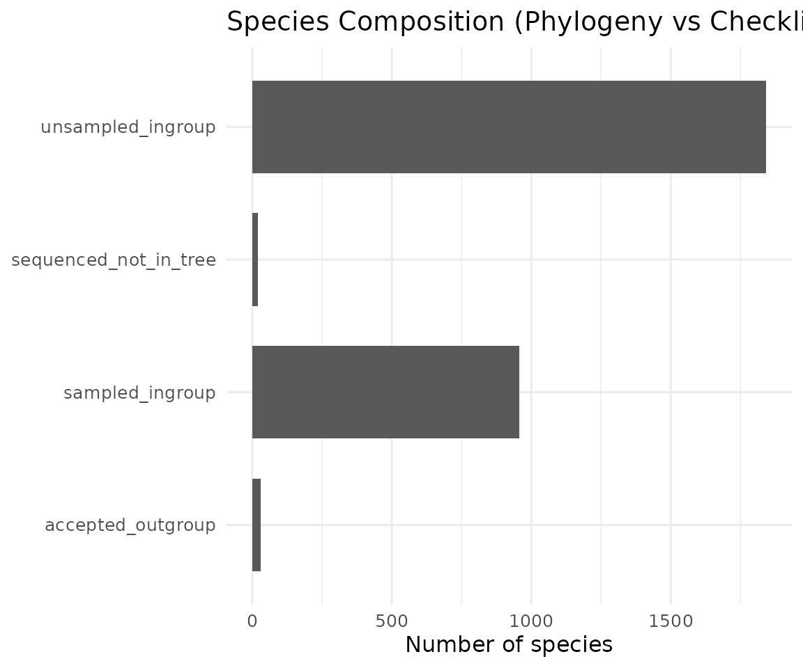

#### Figure 2: Marker Coverage

This figure summarizes the taxonomic representation of each molecular
marker included in the final phylogenetic dataset by showing the number
of species with available sequence information for each locus.

``` r

p2 <- ggplot(marker_stats, aes(x = reorder(marker, n_taxa), y = n_taxa)) +
  geom_col() + coord_flip() + theme_minimal(base_size = 12) +
  labs(title = "Marker Coverage Across Species", x = "Marker", y = "Number of species")
print(p2)
```

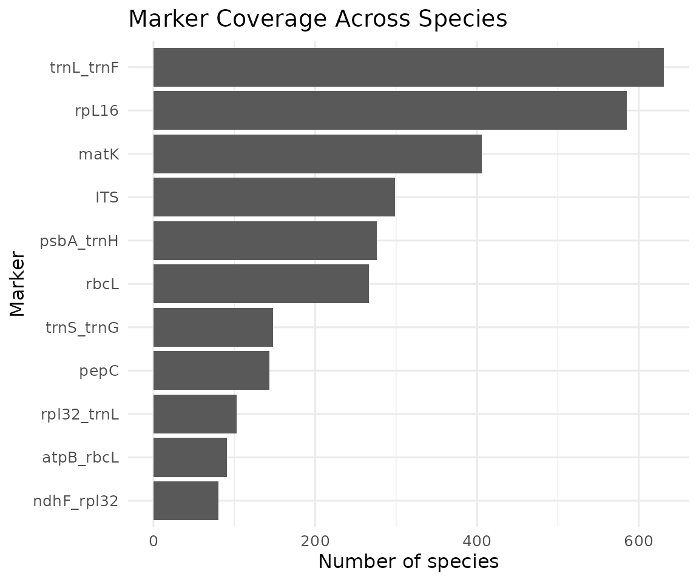

#### Figure 3: Marker Completeness

This histogram illustrates the distribution of molecular marker
completeness across taxa included in the final phylogenetic dataset. The
figure shows how many markers were successfully retained for each
species after sequence filtering and quality control procedures.

Assessing marker completeness is essential for evaluating variation in
molecular sampling among taxa and identifying potential biases
associated with uneven locus representation. Species with reduced marker
coverage may contain higher levels of missing data, which can influence
phylogenetic resolution and downstream comparative analyses.

``` r

if("retained_markers" %in% names(species_summary_iucn)){
  p3 <- ggplot(species_summary_iucn %>% filter(in_phylogeny == TRUE), aes(x = retained_markers)) +
      geom_histogram(binwidth = 1, color = "white") +
      scale_x_continuous(breaks = seq(1, 11, 1)) + theme_minimal(base_size = 12) +
      labs(title = "Distribution of Marker Completeness", x = "Number of retained markers", y = "Number of species")
  print(p3)
}
```

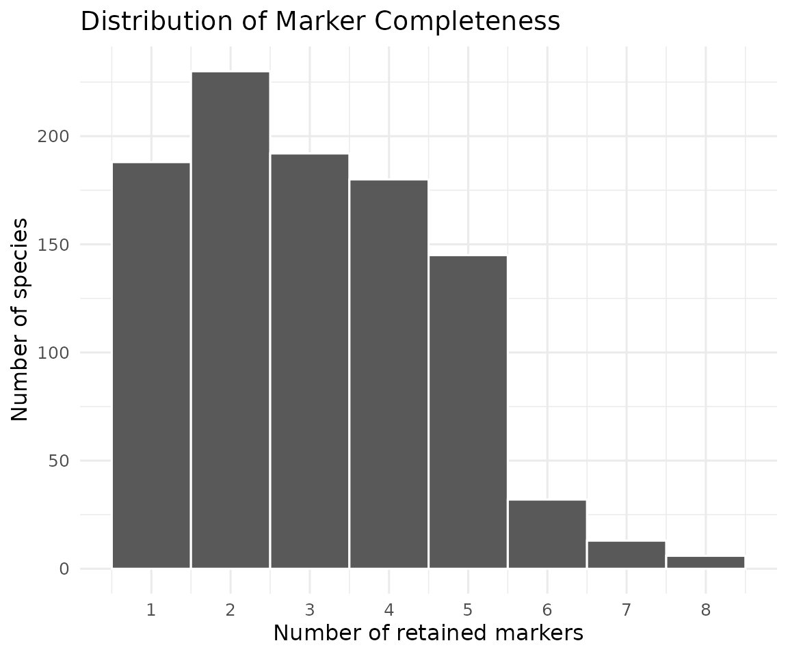

#### Figure 4: Marker Presence Heatmap

This heatmap displays the distribution of molecular marker availability
across species included in the final phylogenetic dataset, indicating
the presence or absence of sequence information for each locus. The
visualization provides a detailed overview of missing data patterns
among taxa and markers, allowing researchers to evaluate whether
incomplete sampling is concentrated in specific lineages or genomic
regions.

``` r

heatmap_data <- species_summary_iucn %>% filter(in_phylogeny == TRUE) %>% select(species, all_of(marker_cols)) %>%
  pivot_longer(cols = all_of(marker_cols), names_to = "marker", values_to = "accession") %>% mutate(present = accession != "-")

p4 <- ggplot(heatmap_data, aes(x = marker, y = fct_rev(species), fill = present)) +
  scale_fill_grey(start = 0.95, end = 0.25) + geom_tile() + theme_minimal(base_size = 10) +
  labs(title = "Marker Presence Heatmap", x = "Marker", y = "Species") +
  theme(axis.text.y = element_blank(), axis.ticks.y = element_blank(), axis.text.x = element_text(angle = 45, hjust = 1))
print(p4)
```

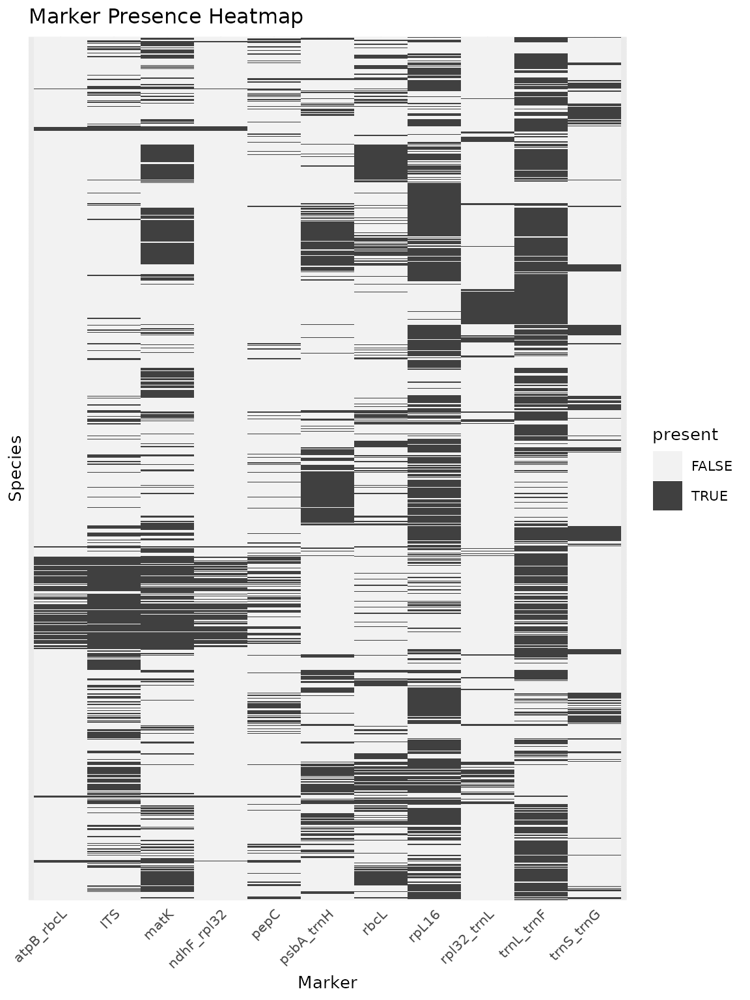

#### Figure 5: Supermatrix Structure

This figure illustrates the organization of the concatenated multilocus
supermatrix by displaying the position and boundaries of each molecular
marker within the final partition scheme.

``` r

# Only evaluate if the file exists
if (file.exists(system.file("extdata", "TABLE_marker_ranges.tsv", package = "CactusPhylo"))) {
  TABLE_marker_ranges <- read_tsv(system.file("extdata", "TABLE_marker_ranges.tsv", package = "CactusPhylo"), show_col_types = FALSE)

  if("marker" %in% names(TABLE_marker_ranges)) {
    p5 <- ggplot(TABLE_marker_ranges) + geom_segment(aes(x = start, xend = end, y = marker, yend = marker), linewidth = 6) +
      theme_minimal(base_size = 12) + labs(title = "Supermatrix Structure", x = "Alignment position", y = "Marker")
    print(p5)
  }
}
```

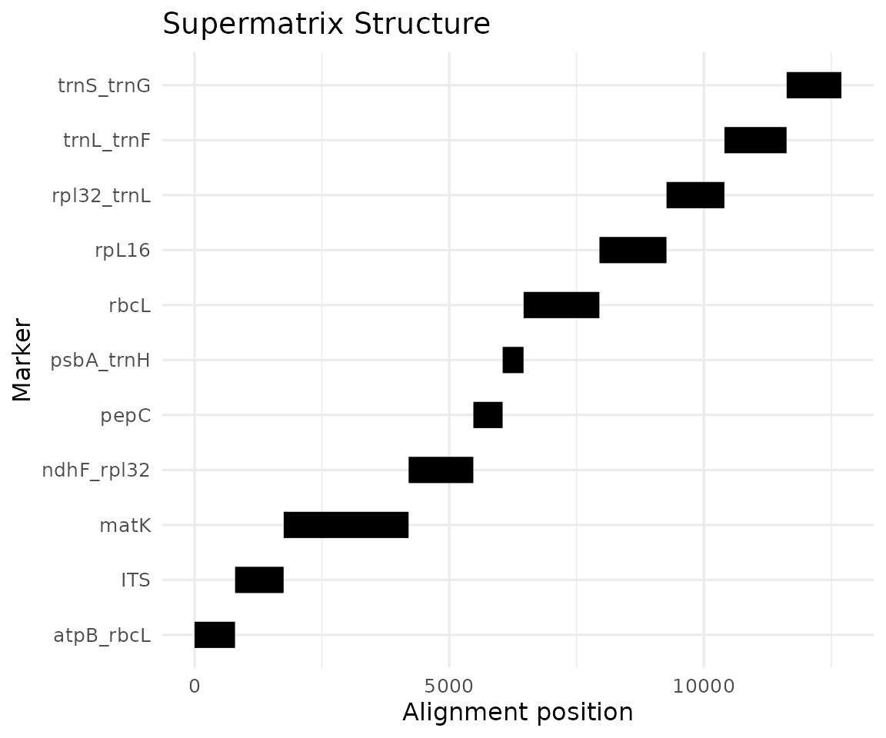

#### Figure 6: Marker Informativeness

We graph the number of parsimony informative sites against the alignment
length for each marker, assessing the phylogenetic utility of each
region.

``` r

if("parsimony_informative" %in% names(marker_stats)) {
  p6 <- ggplot(marker_stats, aes(x = alignment_length, y = parsimony_informative, label = marker)) +
      geom_point(size = 3) + geom_text(nudge_y = 20, size = 3) + theme_minimal(base_size = 12) +
      labs(title = "Marker Informativeness", x = "Alignment length", y = "Parsimony informative sites")
  print(p6)
}
```

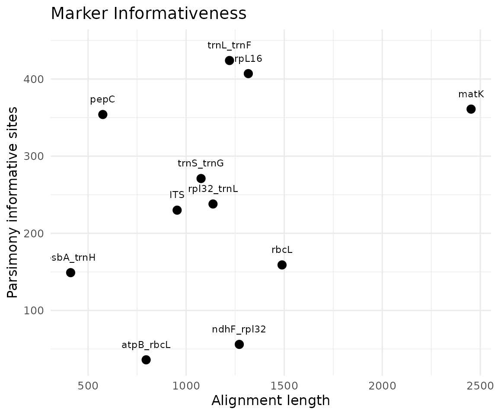

#### Figure 7: IUCN Categories

This bar chart summarizes the distribution of IUCN conservation
categories among the ingroup species included in the final phylogenetic
reconstruction.

The visualization quantifies the representation of threatened and
non-threatened taxa across the evolutionary framework, including
categories ranging from Least Concern (LC) to the highest extinction
risk categories (Vulnerable, Endangered, and Critically Endangered).
This overview provides an initial assessment of how conservation status
is distributed across the sampled phylogenetic diversity and highlights
the representation of threatened evolutionary lineages within the
dataset.

``` r

if(any(species_summary_iucn$iucn_found, na.rm=TRUE)) {
  TABLE_iucn_categories <- species_summary_iucn %>% filter(iucn_found == TRUE, in_phylogeny == TRUE, is_ingroup == TRUE) %>% count(iucn_category, iucn_category_name, sort = TRUE)
  
  p7 <- ggplot(TABLE_iucn_categories, aes(x = reorder(iucn_category, n), y = n, fill = iucn_category)) +
      CactusPhylo::scale_fill_iucn(name = "IUCN Category") + geom_col() + theme_minimal(base_size = 12) +
      labs(title = "IUCN Categories (Ingroup Phylogeny)", x = "Category", y = "Number of species")
  print(p7)
}
```

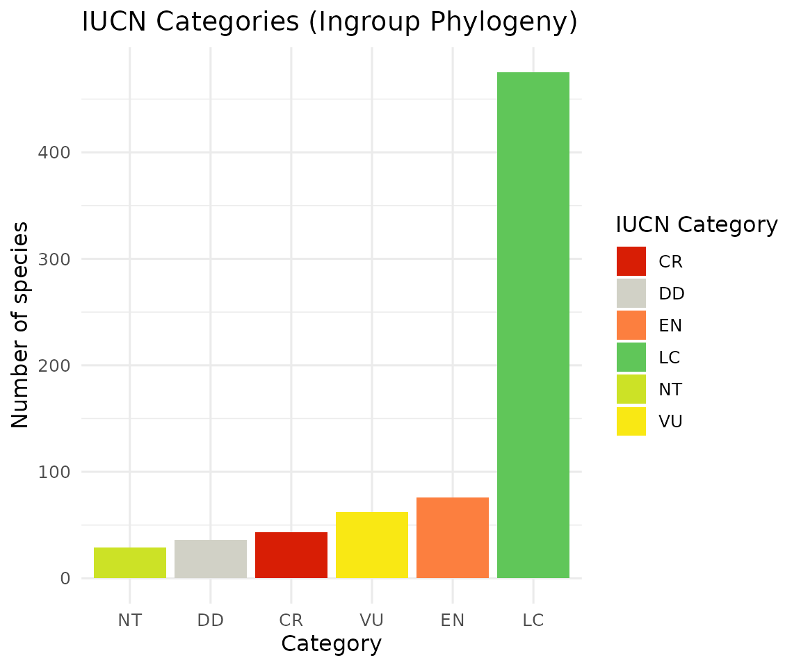

#### Figure 8: Completeness vs. IUCN Category

This plot compares molecular completeness against IUCN conservation
categories, allowing us to evaluate if certain threat categories are
systematically under-sequenced.

``` r

if(any(species_summary_iucn$iucn_found, na.rm=TRUE)) {
  p8 <- ggplot(species_summary_iucn %>% filter(iucn_found == TRUE, in_phylogeny == TRUE, is_ingroup == TRUE), aes(x = iucn_category, y = pct_markers, fill = iucn_category)) +
      geom_violin(trim = FALSE) + CactusPhylo::scale_fill_iucn(name = "IUCN Category") + geom_boxplot(width = 0.15, outlier.size = 0.5) +
      theme_minimal(base_size = 12) + labs(title = "Molecular Completeness vs IUCN Category", x = "IUCN category", y = "Marker completeness (%)")
  print(p8)
}
```

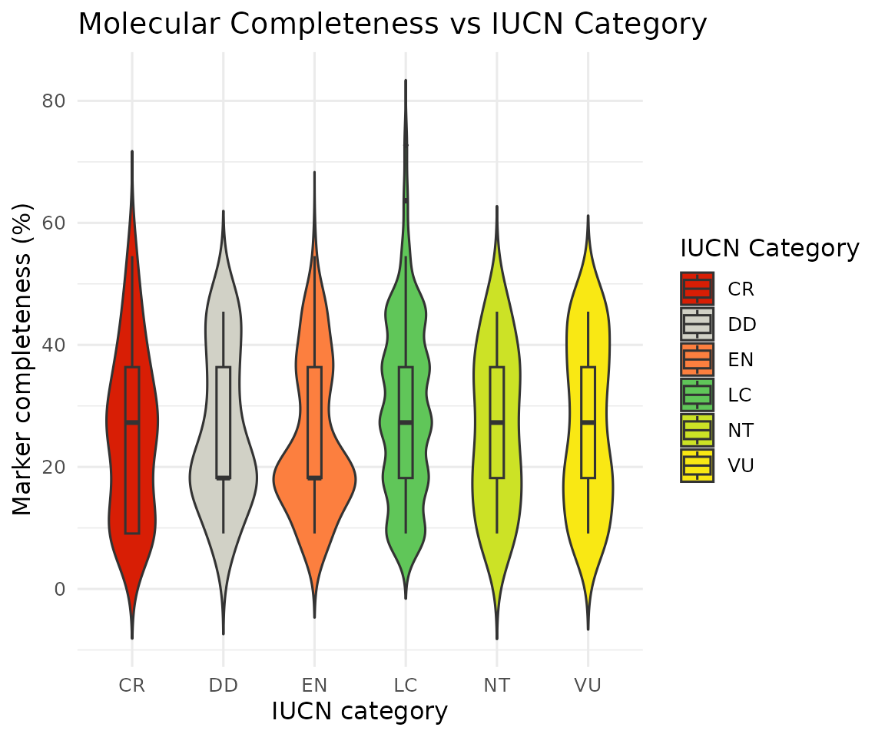

#### Figure 9: Endemism by Country

This figure summarizes the geographic distribution of endemic species
represented in the final phylogenetic dataset by ranking countries
according to the number of endemic taxa included in the analysis.

The visualization focuses exclusively on species incorporated into the
phylogenetic framework and identified as endemic according to available
conservation metadata. Because this summary is based on the available
molecular and conservation records, it should be interpreted as a
representation of sampled phylogenetic diversity rather than a complete
estimate of national cactus endemism.

``` r

if(any(species_summary_iucn$iucn_is_endemic, na.rm=TRUE)) {
  plot_data_endimism <- species_summary_iucn %>% filter(iucn_is_endemic == TRUE, in_phylogeny == TRUE, is_ingroup == TRUE) %>% separate_rows(iucn_endemic_locations, sep = "; ") %>% count(iucn_endemic_locations, sort = TRUE) %>% slice_max(n, n = 20)
  p9 <- ggplot(plot_data_endimism, aes(x = reorder(iucn_endemic_locations, n), y = n)) + geom_col() + coord_flip() + theme_minimal(base_size = 12) +
      labs(title = "Endemic Species by Country (Ingroup Phylogeny)", x = "Country", y = "Number of endemic species")
  print(p9)
}
```

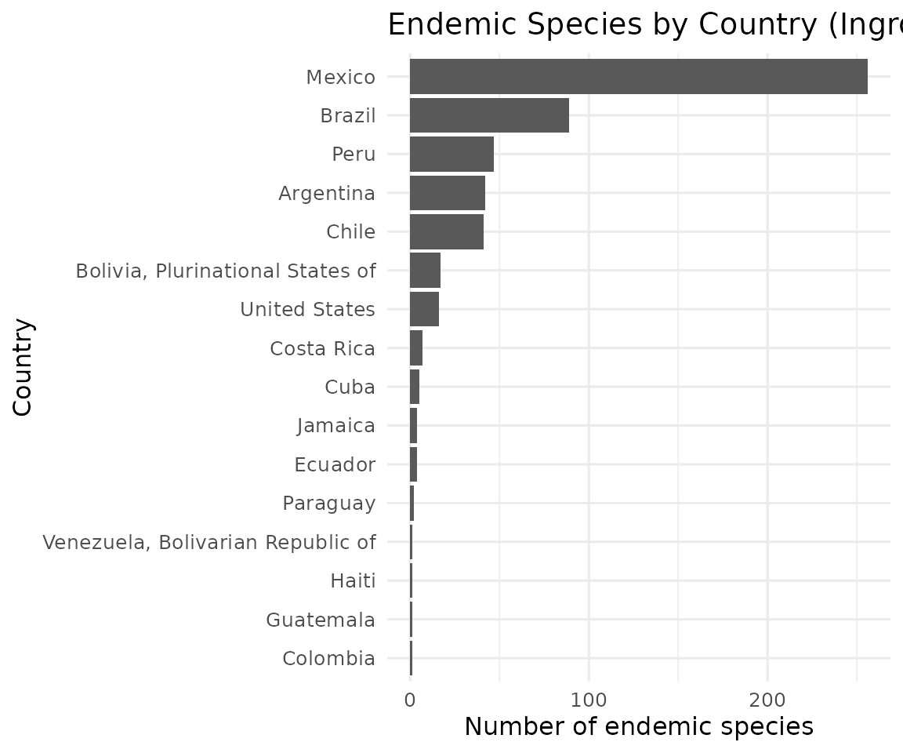

#### Figure 10: IUCN Categories by Country (Endemic)

This stacked bar chart summarizes the conservation status of endemic
species across countries represented in the phylogenetic dataset,
separating taxa according to their respective IUCN threat categories.

``` r

if(any(species_summary_iucn$iucn_found, na.rm=TRUE)) {
  plot_iucn_country <- species_summary_iucn %>% filter(iucn_is_endemic == TRUE, in_phylogeny == TRUE, is_ingroup == TRUE, !is.na(iucn_endemic_locations)) %>% separate_rows(iucn_endemic_locations, sep = "; ") %>% count(iucn_endemic_locations, iucn_category)
  top_countries <- plot_data_endimism$iucn_endemic_locations
  plot_iucn_country <- plot_iucn_country %>% filter(iucn_endemic_locations %in% top_countries)
  if(nrow(plot_iucn_country) > 0) {
    p10 <- ggplot(plot_iucn_country, aes(x = factor(iucn_endemic_locations, levels = rev(top_countries)), y = n, fill = iucn_category)) +
      geom_col() + coord_flip() + CactusPhylo::scale_fill_iucn(name = "IUCN Category") + theme_minimal(base_size = 12) +
      labs(title = "Endemic Species by Country and IUCN Category", x = "Country", y = "Number of endemic species")
    print(p10)
  }
}
```

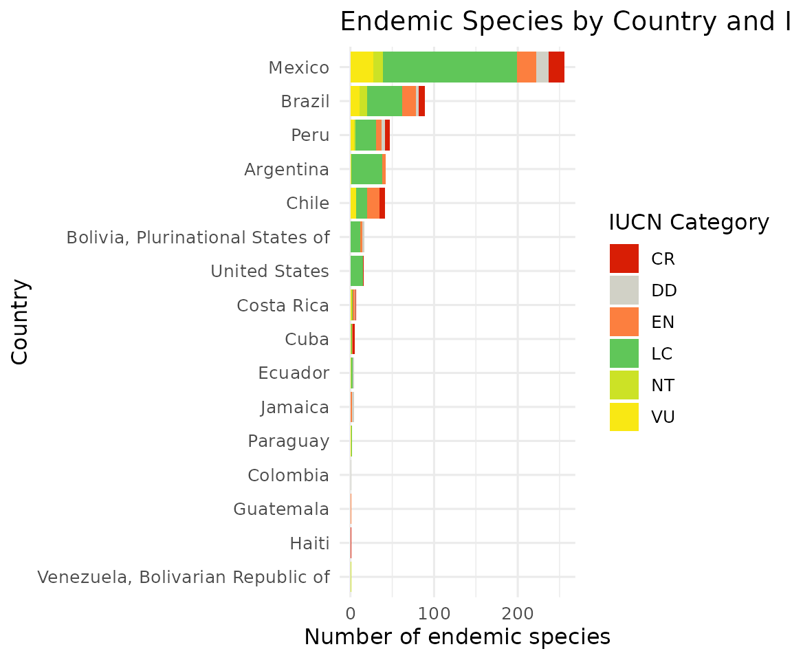

#### Figure 11 & 12: Threats and Habitats

These two figures summarize the most frequently identified threats and
the primary ecological habitats for the species in our dataset.

``` r

if(any(!is.na(species_summary_iucn$iucn_threat_names))) {
  plot_threats <- species_summary_iucn %>% filter(!is.na(iucn_threat_names), in_phylogeny == TRUE, is_ingroup == TRUE) %>% separate_rows(iucn_threat_names, sep = "; ") %>% count(iucn_threat_names, sort = TRUE) %>% slice_max(n, n = 15)
  if(nrow(plot_threats) > 0) {
    p11 <- ggplot(plot_threats, aes(x = reorder(iucn_threat_names, n), y = n)) + geom_col() + coord_flip() + theme_minimal(base_size = 12) +
        labs(title = "Most Common Threats (Ingroup Phylogeny)", x = "Threat", y = "Number of species")
    print(p11)
  }
}
```

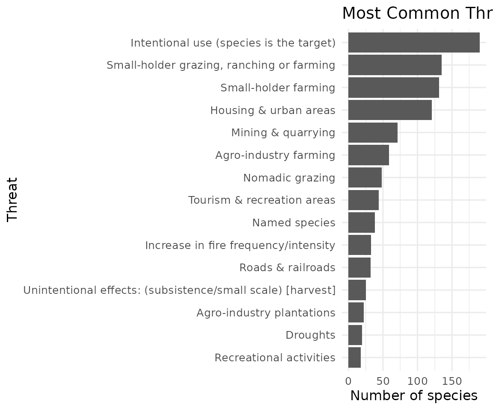

``` r


if(any(!is.na(species_summary_iucn$iucn_habitat_names))) {
  plot_habitats <- species_summary_iucn %>% filter(!is.na(iucn_habitat_names), in_phylogeny == TRUE, is_ingroup == TRUE) %>% separate_rows(iucn_habitat_names, sep = "; ") %>% count(iucn_habitat_names, sort = TRUE) %>% slice_max(n, n = 15)
  if(nrow(plot_habitats) > 0) {
    p12 <- ggplot(plot_habitats, aes(x = reorder(iucn_habitat_names, n), y = n)) + geom_col() + coord_flip() + theme_minimal(base_size = 12) +
        labs(title = "Most Common Habitats (Ingroup Phylogeny)", x = "Habitat", y = "Number of species")
    print(p12)
  }
}
```

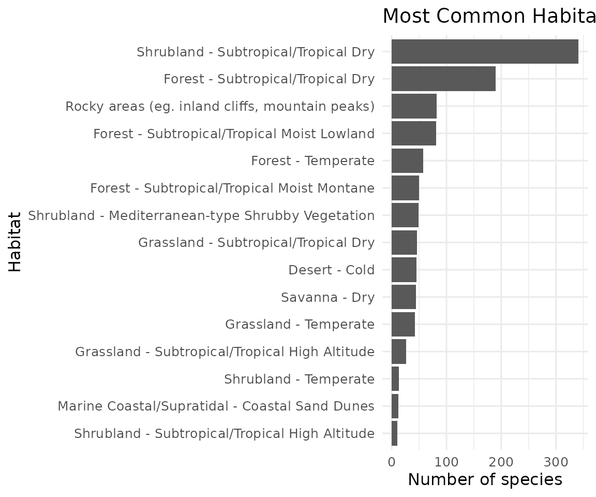

### Module 12: Render Manuscript Figures

After completing phylogenetic inference, divergence time estimation, and
metadata integration, the final analytical stage consists of generating
visual representations of the evolutionary hypotheses produced by
`CactusPhylo`.

This module focuses on the graphical integration of the two principal
phylogenetic outputs generated throughout the pipeline:

1.  The **maximum likelihood phylogeny**, representing the inferred
    evolutionary relationships and their associated branch support
    values.
2.  The **time calibrated chronogram**, representing the temporal
    diversification history of **Cactaceae** obtained through penalized
    likelihood dating and summarized temporal bootstrap replicates.

Although `CactusPhylo` provides automated visualization functions for
routine exploration, this tutorial presents a transparent workflow based
on established phylogenetic visualization frameworks, including
`ggtree`, `treeio`, and `ape`.

#### Visualization Strategy

The maximum likelihood tree is visualized using the constrained topology
inferred during phylogenetic reconstruction. Branch support values
obtained from transfer bootstrap expectation (TBE) analyses are mapped
directly onto internal nodes, allowing researchers to evaluate the
robustness of inferred relationships among cactus lineages.

The dated chronogram is visualized using the consensus tree generated
from the temporal bootstrap replicates described in **Module 10**. Node
age uncertainty is represented using the confidence intervals summarized
by `TreeAnnotator`. Although `TreeAnnotator` reports these intervals
using the terminology “95% Highest Posterior Density (HPD)”, these
values do not represent Bayesian posterior probabilities. Within the
`CactusPhylo` framework, they correspond to confidence intervals derived
from variation among independently dated temporal bootstrap replicates.

Together, these visualizations provide complementary perspectives of
cactus evolution by integrating phylogenetic uncertainty, divergence
timing, and hierarchical taxonomic structure.

The following sections demonstrate how to generate the main manuscript
figures and extended supplementary visualizations:

#### Figure 13: Maximum-Likelihood Tree with TBE Support

This plot displays the maximum likelihood phylogeny. Due to the high
number of tips, this base figure is designed for exploratory inspection.

``` r

library(ggtree)
library(ape)
library(tidytree)

# -------------------------------------------------------------
# Figure 13: Maximum-Likelihood Tree with TBE Support
# -------------------------------------------------------------
message("Rendering Figure 13 (maximum-likelihood tree)...")
# Load the support tree evaluated in Module 9
supp_tree_file <- system.file("extdata", "cactus_support.raxml.support", package = "CactusPhylo")

if (file.exists(supp_tree_file) && nzchar(supp_tree_file)) {
  ml_tree <- read.tree(supp_tree_file)
  ml_tree <- ape::ladderize(ml_tree)
  
  # Load constraints table required for annotation
  constraints_csv_path <- system.file("extdata", "cactus_constraints.csv", package = "CactusPhylo")
  if (file.exists(constraints_csv_path) && nzchar(constraints_csv_path)) {
    constraints_tbl <- read_csv(constraints_csv_path, show_col_types = FALSE)
    
    # Ensure tree node labels match Nnode
    if (is.null(ml_tree$node.label)) {
      ml_tree$node.label <- rep(NA_character_, ml_tree$Nnode)
    }

    MAIN_LEVEL4_VALUES <- c("Anacampseros", "Grahamia", "Talinopsis", "Leuenbergeria", "Pereskia", "Maihuenia", "Blossfeldia", "Opuntieae", "Cylindropuntieae", "Tephrocacteae", "Cacteae", "Core I", "Core II", "Copiapoa", "Calymmanthium", "Rhipsalis", "Portulaca", "Notocacteae", "BCT", "Rhipsalideae")
    ML_MAIN_LAYER_SPECS <- tibble::tribble(
      ~reg_name, ~fontsize, ~barsize, ~offset, ~offset_text, ~fontface, ~sort_desc, ~angle, ~align,
      "level_4_main", 2.5, 0.34, 0.010, 0.0038, "plain", TRUE, 0, TRUE,
      "level_3", 3.5, 0.50, 0.170, 0.0055, "bold", TRUE, 270, TRUE,
      "level_2", 4.0, 0.75, 0.220, 0.0100, "bold", TRUE, 270, TRUE,
      "level_1", 4.5, 0.85, 0.270, 0.0100, "bold", TRUE, 270, TRUE
    )
    
    registry <- CactusPhylo::build_annotation_registry(
      tree = ml_tree,
      constraints_tbl = constraints_tbl,
      main_level4_values = MAIN_LEVEL4_VALUES,
      supp_level4_min_tips = 3L
    )

    # Parse numerical support and map it to visual classes
    ml_tree_data <- tidytree::as_tibble(ml_tree) %>%
      mutate(
        support = suppressWarnings(as.numeric(label)),
        support_label = ifelse(!is.na(support), sprintf("%.3f", support), NA_character_),
        support_class = case_when(
          support >= 0.90 ~ ">= 90",
          support >= 0.70 ~ "70-89",
          TRUE ~ "< 70"
        ),
        support_class = factor(support_class, levels = c(">= 90", "70-89", "< 70"))
      )
    ml_tree_plot <- tidytree::as.treedata(ml_tree_data)

    p_ml <- ggtree(ml_tree_plot, size = 0.3) +
      theme_tree() +
      geom_nodepoint(aes(fill = support_class), shape = 21, size = 2, stroke = 0.2, na.rm = TRUE) +
      scale_fill_manual(
        values = c(">= 90" = "white", "70-89" = "grey", "< 70" = "black"),
        name = "TBE Support",
        na.translate = FALSE
      ) +
      theme(legend.position = "bottom")

    # Apply complex formatting using original script logic
    p_ml <- CactusPhylo::apply_clade_label_layers(p_ml, registry, ML_MAIN_LAYER_SPECS)
    # Add expansion for large trees
    xmax <- max(p_ml$data$x, na.rm = TRUE)
    p_ml <- p_ml + coord_cartesian(xlim = c(0, xmax + xmax * 0.35), clip = "off") + theme(plot.margin = margin(12, 12, 12, 12))

    print(p_ml)
  }
}
```

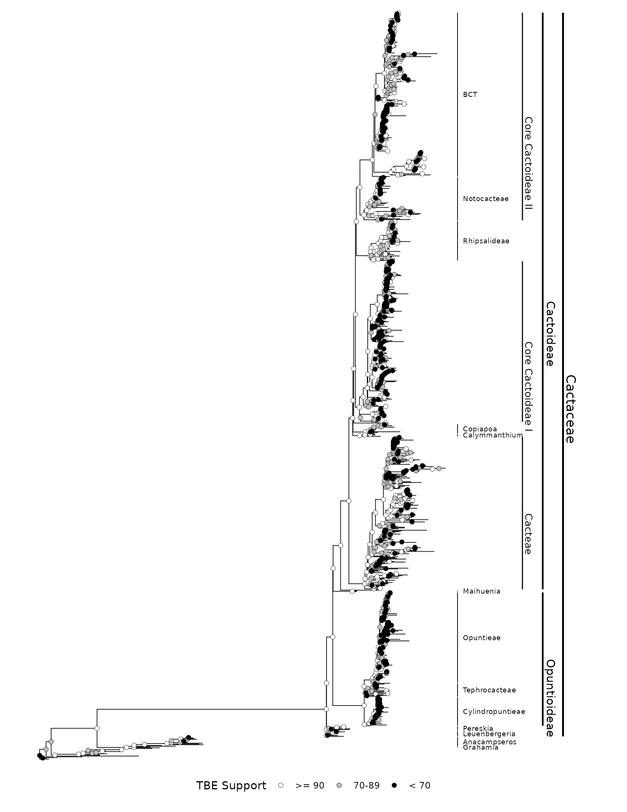

#### Figure 14: Extended Constrained ML Phylogeny

The following plot renders the complete maximum-likelihood tree without
collapsing the nodes. Because of the large number of tips, this figure
is formatted as an A0-sized poster. You can use the scrollbars below to
explore the entire topology, seeing individual species placements and
their respective TBE support.

``` r

# -------------------------------------------------------------
# Figure 14: Extended Constrained ML Phylogeny
# -------------------------------------------------------------
if (file.exists(supp_tree_file) && nzchar(supp_tree_file)) {
    ML_SUPP_LAYER_SPECS <- tibble::tribble(
      ~reg_name, ~fontsize, ~barsize, ~offset, ~offset_text, ~fontface, ~sort_desc, ~angle, ~align,
      "level_4_supp", 6, 0.60, 0.030, 0.0038, "plain", TRUE, 0, TRUE,
      "level_3", 8, 0.65, 0.150, 0.0038, "bold", TRUE, 270, TRUE,
      "level_2", 9, 0.70, 0.200, 0.0100, "bold", TRUE, 270, TRUE,
      "level_1", 10, 0.80, 0.250, 0.0100, "bold", TRUE, 270, TRUE
    )
    
    p_ml_supp <- ggtree(ml_tree_plot, size = 0.2) +
      theme_tree() +
      geom_tiplab(size = 0.70, align = FALSE, linetype = "solid", linesize = 0.15, colour = "grey20") +
      geom_nodelab(aes(label = support_label), size = 0.70, hjust = 0.7, colour = "black", na.rm = TRUE) +
      theme(legend.position = "none")
      
    p_ml_supp <- CactusPhylo::apply_clade_label_layers(p_ml_supp, registry, ML_SUPP_LAYER_SPECS)
    xmax_supp <- max(p_ml_supp$data$x, na.rm = TRUE)
    p_ml_supp <- p_ml_supp + coord_cartesian(xlim = c(0, xmax_supp + xmax_supp * 0.30), clip = "off") + theme(plot.margin = ggplot2::margin(12, 12, 12, 12))
    
    # save plot
    
    ggplot2::ggsave("9_Visualization/figures/Extended_ML_Phylogeny.pdf", plot = p_ml_supp, width = 36, height = 48, limitsize = FALSE)
}
```

> To explore the complete topology in high resolution, you can view and
> download the tree poster here:
>
> [⬇️ Download Annotated Maximum-Likelihood Phylogeny with TBE Support
> (PDF)](https://github.com/beeamerino/CactusPhylo/blob/ab196ef24a515330b9be9356e72741c0ef05585a/inst/extdata/Extended_ML_Phylogeny.pdf)

If you wish to export the annotated `treedata` object into `.tree`
(Nexus/BEAST format) to analyze in exterior software such as FigTree
interactively, you can export it via treeio:

``` r

annotated_treedata <- CactusPhylo::augment_treedata_with_registry(ml_tree_plot, registry)
treeio::write.beast(annotated_treedata, file = "9_Visualization/figures/annotated_ml_tree.tree")
```

> Alternatively, you can download the already computed `.tree` file
> natively from our repository:
>
> [⬇️ Download Annotated Maximum-Likelihood Phylogeny with TBE Support
> (.tree)](https://raw.githubusercontent.com/beeamerino/CactusPhylo/refs/heads/master/inst/extdata/cactus_support.raxml.support)

#### Figure 15: Time-Calibrated Chronogram

This plot presents the time-calibrated version of our phylogeny,
overlaying estimated divergence times and their 95% Highest Posterior
Density (HPD) ranges.

``` r

# -------------------------------------------------------------
# Figure 15: Time-Calibrated Chronogram with HPD intervals
# -------------------------------------------------------------
message("Rendering Figure 15 (Chronogram)...")
# Load the TreeAnnotator summary chronogram from Module 10
chrono_file <- system.file("extdata", "dated_summary_hpd.tree", package = "CactusPhylo")

if (file.exists(chrono_file) && nzchar(chrono_file)) {
  chrono_beast <- treeio::read.beast(chrono_file)
  
  constraints_csv_path <- system.file("extdata", "cactus_constraints.csv", package = "CactusPhylo")
  if (file.exists(constraints_csv_path) && nzchar(constraints_csv_path)) {
    constraints_tbl <- read_csv(constraints_csv_path, show_col_types = FALSE)
    tree_phy <- as.phylo(chrono_beast)
    
    if (is.null(tree_phy$node.label)) {
      tree_phy$node.label <- rep(NA_character_, tree_phy$Nnode)
    }

    MAIN_LEVEL4_VALUES <- c("Anacampseros", "Grahamia", "Talinopsis", "Leuenbergeria", "Pereskia", "Maihuenia", "Blossfeldia", "Opuntieae", "Cylindropuntieae", "Tephrocacteae", "Cacteae", "Core I", "Core II", "Copiapoa", "Calymmanthium", "Rhipsalis", "Portulaca", "Notocacteae", "BCT", "Rhipsalideae")
    CHRONO_MAIN_LAYER_SPECS <- tibble::tribble(
      ~reg_name, ~fontsize, ~barsize, ~offset, ~offset_text, ~fontface, ~sort_desc, ~angle, ~align,
      "level_4_main", 2.5, 0.34, 0.010, 0.0038, "plain", TRUE, 0, TRUE,
      "level_3", 3.5, 0.50, 0.170, 0.0055, "bold", TRUE, 270, TRUE,
      "level_2", 4.0, 0.75, 0.220, 0.0100, "bold", TRUE, 270, TRUE,
      "level_1", 4.5, 0.85, 0.270, 0.0100, "bold", TRUE, 270, TRUE
    )
    
    registry_chrono <- CactusPhylo::build_annotation_registry(
      tree = tree_phy,
      constraints_tbl = constraints_tbl,
      main_level4_values = MAIN_LEVEL4_VALUES,
      supp_level4_min_tips = 3L
    )

    p_chrono <- ggtree(chrono_beast, size = 0.3) +
      theme_tree2() + 
      geom_range(range = 'height_0.95_HPD', color = 'gray60', alpha = 0.4, linewidth = 1.5) +
      theme_tree()
    
    p_chrono <- CactusPhylo::apply_clade_label_layers(p_chrono, registry_chrono, CHRONO_MAIN_LAYER_SPECS)
    p_chrono <- CactusPhylo::add_chronogram_axis(p_chrono, tree_phy, by = 5, digits = 0L, segment_size = 3, title_margin_top = 30)
    
    xmax <- max(p_chrono$data$x, na.rm = TRUE)
    p_chrono <- p_chrono + coord_cartesian(xlim = c(0, xmax + xmax * 0.35), clip = "off") + theme(plot.margin = margin(12, 12, 12, 12))
      
    print(p_chrono)
  }
}
```

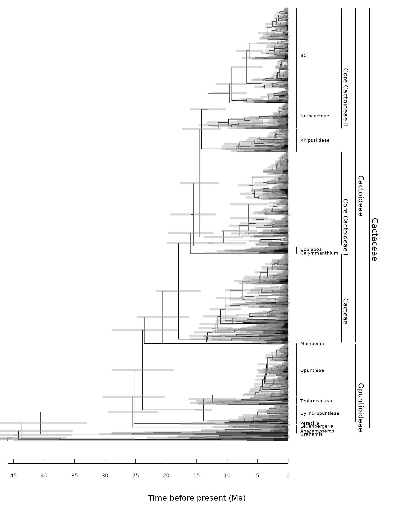

#### Figure 16: Extended Time Calibrated Chronogram

This plot displays the complete uncollapsed `treePL` chronogram. Similar
to the maximum-likelihood tree, it is presented in A0 dimensions so that
all species-level temporal estimates, including their 95% Highest
Posterior Density (HPD) bars, are visible. Scroll to explore the precise
ages of all clades.

``` r

# -------------------------------------------------------------
# Figure 16: Extended Time-Calibrated Chronogram
# -------------------------------------------------------------
if (file.exists(chrono_file) && nzchar(chrono_file)) {
    CHRONO_SUPP_LAYER_SPECS <- tibble::tribble(
      ~reg_name, ~fontsize, ~barsize, ~offset, ~offset_text, ~fontface, ~sort_desc, ~angle, ~align,
      "level_4_supp", 6, 0.60, 0.030, 0.0038, "plain", TRUE, 0, TRUE,
      "level_3", 8, 0.65, 0.150, 0.0038, "bold", TRUE, 270, TRUE,
      "level_2", 9, 0.70, 0.200, 0.0100, "bold", TRUE, 270, TRUE,
      "level_1", 10, 0.80, 0.250, 0.0100, "bold", TRUE, 270, TRUE
    )
    
    p_chrono_supp <- ggtree(chrono_beast, size = 0.2) +
      theme_tree2() +
      geom_tiplab(size = 0.85, align = FALSE, linetype = "solid", linesize = 0.15, colour = "grey20") +
      geom_range(range = 'height_0.95_HPD', color = 'gray60', alpha = 0.4, linewidth = 0.8) +
      theme_tree()
      
    p_chrono_supp <- CactusPhylo::apply_clade_label_layers(p_chrono_supp, registry_chrono, CHRONO_SUPP_LAYER_SPECS)
    p_chrono_supp <- CactusPhylo::add_chronogram_axis(p_chrono_supp, tree_phy, by = 5, digits = 0L, segment_size = 10, title_margin_top = 28, bar_size = 30)
    xmax_chrono_supp <- max(p_chrono_supp$data$x, na.rm = TRUE)
    p_chrono_supp <- p_chrono_supp + coord_cartesian(xlim = c(0, xmax_chrono_supp + xmax_chrono_supp * 0.30), clip = "off") + theme(plot.margin = ggplot2::margin(12, 12, 32, 12))
    
    # save plot
    ggplot2::ggsave("9_Visualization/figures/Extended_Chronogram.pdf", plot = p_chrono_supp, width = 36, height = 48, limitsize = FALSE)
    
}
```

> To explore the precise ages of all clades in high resolution, you can
> view and download the chronogram poster here:
>
> [⬇️ Download Annotated Time-Calibrated Chronogram
> (PDF)](https://github.com/beeamerino/CactusPhylo/blob/ab196ef24a515330b9be9356e72741c0ef05585a/inst/extdata/Extended_Chronogram.pdf)

If you wish to export the annotated chronogram `treedata` object into
`.tree` (Nexus/BEAST format) to analyze in exterior software such as
FigTree interactively, you can export it via treeio:

``` r

annotated_chrono <- CactusPhylo::augment_treedata_with_registry(chrono_beast, registry_chrono)
treeio::write.beast(annotated_chrono, file = "9_Visualization/figures/annotated_chronogram.tree")
```

> Alternatively, you can download the already computed `.tree` file
> natively from our repository:
>
> [⬇️ Download Annotated Time-Calibrated Chronogram
> (.tree)](https://raw.githubusercontent.com/beeamerino/CactusPhylo/refs/heads/master/inst/extdata/dated_summary_hpd.tree)

## Next Steps

At this stage, phylogenetic visualization and conservation metadata
integration have been successfully completed. The resulting outputs
provide a comprehensive representation of the evolutionary framework
generated by `CactusPhylo`, including the inferred maximum likelihood
topology, the time calibrated chronogram, molecular sampling
completeness, and associated conservation information.

The next stage focuses on **phylogenetic validation and comparative
analyses**, where the robustness of the focal phylogenetic hypothesis
will be evaluated against previously published evolutionary frameworks
and alternative topological hypotheses.

Using quantitative tree comparison approaches, including
**Robinson-Foulds distances** and **multidimensional scaling (MDS)**,
the following tutorial will assess the degree of topological agreement
among alternative phylogenetic hypotheses, identify regions of
phylogenetic uncertainty, and evaluate how differences in taxon sampling
and analytical strategies influence the recovered evolutionary
relationships.

[Continue to Tutorial 4: Phylogenetic Validation and Comparative
Analyses](https://beeamerino.github.io/CactusPhylo/articles/tutorial-4-cactus-phylogeny-validation.html)

------------------------------------------------------------------------

#### References

- Amaral *et al*., 2022. Spatial patterns of evolutionary diversity in
  Cactaceae show low ecological representation within protected areas.
  *Biological Conservation*, 273.
  <https://doi.org/10.1016/j.biocon.2022.109677>
- Thompson, *et al*., 2024. Identifying the multiple drivers of cactus
  diversification. *Nature Communications*, *15*(1).
  <https://doi.org/10.1038/s41467-024-51666-2>
