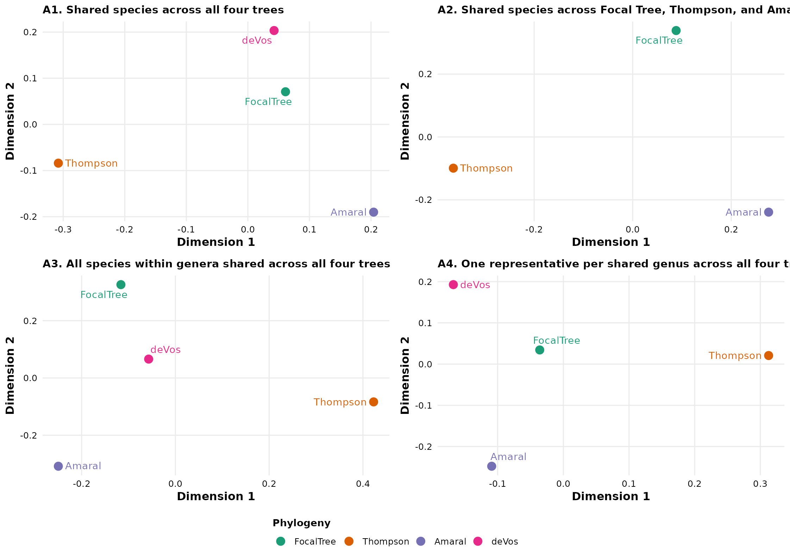

# Tutorial 4: Phylogenetic Validation and Sub-tree Comparisons

### Module 13: Sub-trees and Phylogenetic Validation

The final stage of the `CactusPhylo` phylogenetic framework focuses on
evaluating the robustness and reproducibility of the inferred
evolutionary hypothesis through **phylogenetic validation and
comparative tree analyses**.

Although maximum-likelihood inference provides a statistically supported
estimate of relationships among sampled taxa, the resulting topology
represents one analytical hypothesis among several possible evolutionary
reconstructions. Differences in taxon sampling, molecular markers,
evolutionary models, and analytical strategies may influence the
recovered relationships, particularly for rapidly diversifying groups
such as **Cactaceae**.

This module evaluates the degree of topological agreement between the
focal maximum-likelihood tree generated by `CactusPhylo` and previously
published phylogenetic hypotheses. Validation is performed using
quantitative tree comparison approaches, including **Robinson–Foulds
(RF) distances**, normalized topological distances, and multidimensional
scaling (MDS). These analyses provide an objective framework to identify
congruent evolutionary patterns, detect conflicting relationships, and
evaluate the position of major cactus lineages across alternative
phylogenetic frameworks.

#### Sourcing External Trees and `ASTRAL-III`

Reference phylogenetic hypotheses and external analytical software
required for validation are not included within the `CactusPhylo`
package. This decision avoids distributing large external files and
complies with restrictions associated with third party supplementary
materials and software licenses.

Users must independently download the required reference trees and
install the external programs before executing the validation workflow.

The reference datasets used in this tutorial correspond to three recent
phylogenomic frameworks representing complementary approaches to cactus
evolution:

- **Amaral *et al*. (2022)**:  
  Amaral *et al*., 2022. Spatial patterns of evolutionary diversity in
  Cactaceae show low ecological representation within protected areas.
  *Biological Conservation*, *273*.
  <https://doi.org/10.1016/j.biocon.2022.109677>  
  *(Download the supplementary phylogenetic tree, usually provided as
  `Tree_80MD.tre`.)*

- **Thompson *et al*. (2024)**:  
  Thompson *et al*., 2024. Identifying the multiple drivers of cactus
  diversification. *Nature Communications*, *15*(1).
  <https://doi.org/10.1038/s41467-024-51666-2>  
  *(Download the supplementary ultrametric phylogenetic tree, usually
  provided as `ultra_cacti_JT.tre`.)*

- **de Vos *et al*. (2025)**:  
  de Vos *et al*., 2025. Phylogenomics and classification of Cactaceae
  based on hundreds of nuclear genes. *Plant Systematics and Evolution*,
  *311*(5). <https://doi.org/10.1007/s00606-025-01948-z>  
  *(Download the supplementary gene trees `QC.bestTreeCollapsed.trees`
  and associated metadata file `606_2025_1948_MOESM1_ESM.csv` from the
  Electronic Supplementary Material.)*

#### Gene Tree Summaries with `ASTRAL-III`

For phylogenomic datasets containing multiple independent loci,
individual gene trees may contain conflicting evolutionary signals
caused by incomplete lineage sorting, stochastic variation, or
locus-specific evolutionary histories.

To summarize these independent gene histories, `CactusPhylo` integrates
the species-tree framework implemented by **`ASTRAL-III`**. This
approach estimates a consensus species tree from a collection of gene
trees under the multispecies coalescent framework, providing an
additional reference hypothesis for comparison with the concatenated
maximum-likelihood reconstruction.

The ASTRAL-III Java executable (`.jar`) is not distributed with the
package and must be downloaded separately from the official repository
before running the gene tree summaries workflow.

#### Using `.Renviron` to Manage Paths Safely

When dealing with personal file paths (to software like `ASTRAL-III` or
locally downloaded trees), it is highly recommended to use the
`.Renviron` file. This avoids exposing your local machine paths on the
internet or in your shared code.

``` r

# Add these lines to your ~/.Renviron file (e.g., using usethis::edit_r_environ())
# ASTRAL_PATH="/path/to/astral.5.7.8.jar"
# DEVOS_GENETREES_PATH="/path/to/QC.bestTreeCollapsed.trees"
# DEVOS_METADATA_PATH="/path/to/606_2025_1948_MOESM1_ESM.csv"

# Then access them safely in R:
astral_jar <- Sys.getenv("ASTRAL_PATH")
gene_trees_file <- Sys.getenv("DEVOS_GENETREES_PATH")
metadata_file <- Sys.getenv("DEVOS_METADATA_PATH")
```

#### Standardizing Metadata and Running `ASTRAL`

*Context: Why use `ASTRAL-III`?* The study by de Vos *et al*. (2025) is
a phylogenomic study utilizing the *Angiosperms353* target capture kit.
Because their analysis was centered primarily at the genus level, it
provides an excellent framework for testing topological congruence
against our supermatrix approach. However, because the authors provided
individual gene trees rather than the final coalescent species tree, we
must infer the species tree using `ASTRAL-III` to properly account for
gene tree discordance (e.g., resulting from incomplete lineage sorting)
prior to our comparative analyses.

Using the gene trees and metadata (e.g., from de Vos et al., 2025), you
can map sample names and export renamed gene trees directly to
`ASTRAL-III`.

``` r

# Load Metadata safely from where you downloaded it
meta <- read.csv(Sys.getenv("DEVOS_METADATA_PATH"), check.names = FALSE)

# Create mapping vector
map_sample <- setNames(gsub(" ", "_", meta$`Scientific name`), stringr::str_extract(meta$`Name in tree`, "P[0-9]+"))

# Load and safely rename tips of gene_trees
gene_trees <- ape::read.tree(Sys.getenv("DEVOS_GENETREES_PATH"))
# ... (Iterate over the gene trees, apply mappings, and write to a new file) ...

# Execute `ASTRAL` directly via system command
cmd <- paste("java -jar", Sys.getenv("ASTRAL_PATH"), 
             "-i", "renamed_gene_trees.tre", 
             "-o", "QC.Species_tree_astral.tree")
system(cmd)
```

### Evaluating Topological Congruence Across Alternative Hypotheses

Once external phylogenetic hypotheses have been downloaded, and new
`ASTRAL` species trees inferred, we evaluate topological congruence
against our focal maximum likelihood tree (e.g., the treePL chronogram)
and a set of external trees.

Topological congruence is quantified using Robinson–Foulds (RF)
distances and related tree comparison metrics. These analyses measure
the number of shared and conflicting bipartitions among alternative
phylogenetic hypotheses, allowing researchers to identify the degree of
agreement among datasets generated under different taxon sampling
schemes, molecular evidence, and inference frameworks.

For visualization of relationships among alternative hypotheses,
normalized RF distances are summarized using multidimensional scaling
(MDS). This ordination approach represents phylogenetic hypotheses in a
reduced dimensional space, where closer positions indicate greater
topological similarity and larger distances indicate stronger
disagreement.

**Rendering note:** To allow this vignette to execute reproducibly
without requiring external downloads during package installation,
example reference trees are distributed within the `CactusPhylo`
`extdata` directory. Users applying this workflow to their own datasets
should replace these example files with independently downloaded
published hypotheses or newly generated ASTRAL species trees.

``` r

library(CactusPhylo)

# List of collected trees - fetching from extdata for the package vignette
tree_paths <- list(
  FocalTree   = system.file("extdata", "dated_summary_hpd.tree", package = "CactusPhylo"),
  Thompson    = system.file("extdata", "ultra_cacti_JT.tre", package = "CactusPhylo"),
  Amaral      = system.file("extdata", "Tree_80MD.tre", package = "CactusPhylo"),
  deVos       = system.file("extdata", "QC.Species_tree_astral.tree", package = "CactusPhylo")
)

# Filter missing trees to allow the vignette to build even if you haven't uploaded them yet
existing_trees <- tree_paths[sapply(tree_paths, function(x) file.exists(x) && nzchar(x))]

plot_to_show <- NULL
table_to_show <- NULL

if(length(existing_trees) > 1) {
  checklist_file   <- system.file("extdata", "CactaceaeFullList_accepted.csv", package = "CactusPhylo")
  constraints_file <- system.file("extdata", "cactus_constraints.csv", package = "CactusPhylo")
  
  # The validate_phylogenies wrapper handles tip harmonization, Robinson-Foulds/DPI distance
  # calculations, and tree-space projections automatically.
  validation_outputs <- validate_phylogenies(
    trees_mapping_list = existing_trees,
    checklist_csv = checklist_file,
    constraints_map = constraints_file,
    out_dir = file.path(tempdir(), "10_Validation")
  )
  
  plot_to_show <- validation_outputs$plot
  
  dist_table <- read.csv(file.path(validation_outputs$tables, "TABLE_pairwise_tree_distances_main.csv"))
  table_to_show <- head(dist_table)
} else {
  message("Please upload the reference trees to inst/extdata/ to run the full validation.")
}

plot_to_show
```



| analysis_id | analysis_label | metric | tree_1 | tree_2 | n_common_tips | distance |
|:---|:---|:---|:---|:---|---:|---:|
| A1_species_all4 | A1. Shared species across all four trees | RF | Thompson | FocalTree | 66 | 0.4285714 |
| A1_species_all4 | A1. Shared species across all four trees | RF | Amaral | FocalTree | 66 | 0.3492063 |
| A1_species_all4 | A1. Shared species across all four trees | RF | deVos | FocalTree | 66 | 0.2698413 |
| A1_species_all4 | A1. Shared species across all four trees | RF | Amaral | Thompson | 66 | 0.5238095 |
| A1_species_all4 | A1. Shared species across all four trees | RF | deVos | Thompson | 66 | 0.4603175 |
| A1_species_all4 | A1. Shared species across all four trees | RF | deVos | Amaral | 66 | 0.4285714 |

Pairwise tree distances {.table}

The resulting `TABLE_pairwise_tree_distances_main.csv` and the
multidimensional tree-space projections (`FIG_tree_space_main.pdf`)
provide a quantitative framework for assessing topological congruence
among alternative phylogenetic hypotheses. Together, these outputs allow
researchers to identify regions of agreement and disagreement across
studies, evaluate the robustness of major clades, and determine whether
differences arise from taxon sampling, molecular marker selection, or
phylogenetic inference methodology. This comparative validation provides
an objective measure of confidence in the inferred evolutionary
relationships before downstream macroevolutionary, biogeographic, or
comparative analyses.

## Conclusion

This concludes the complete `CactusPhylo` phylogenetic inference
pipeline. Across the four tutorials, you have assembled a curated
multilocus supermatrix from public sequence repositories, inferred a
robust maximum-likelihood phylogeny, estimated divergence times using
penalized likelihood with temporal bootstrap confidence intervals,
integrated conservation metadata from the IUCN Red List, generated
publication-ready visualizations, and quantitatively validated your
phylogenetic hypothesis against alternative published backbones.

The resulting datasets including aligned supermatrices, maximum
likelihood trees, time calibrated chronograms, species metadata tables,
conservation summaries, and comparative validation metrics—provide a
reproducible foundation for downstream analyses in macroevolution,
historical biogeography, conservation biology, community ecology, and
comparative evolutionary research. By combining automated data
acquisition, rigorous quality control, standardized phylogenetic
inference, and transparent analytical workflows, `CactusPhylo` enables
researchers to construct large scale evolutionary datasets that are
readily reproducible, extensible, and suitable for publication quality
comparative studies.
